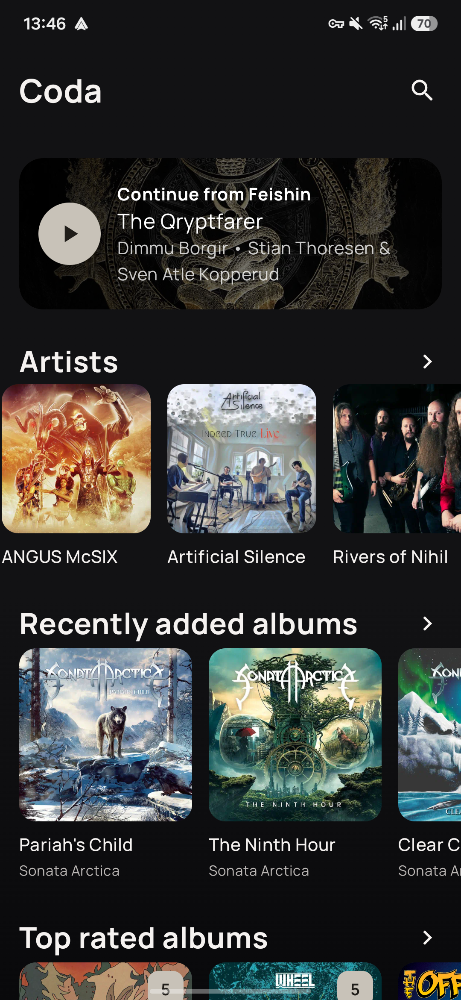
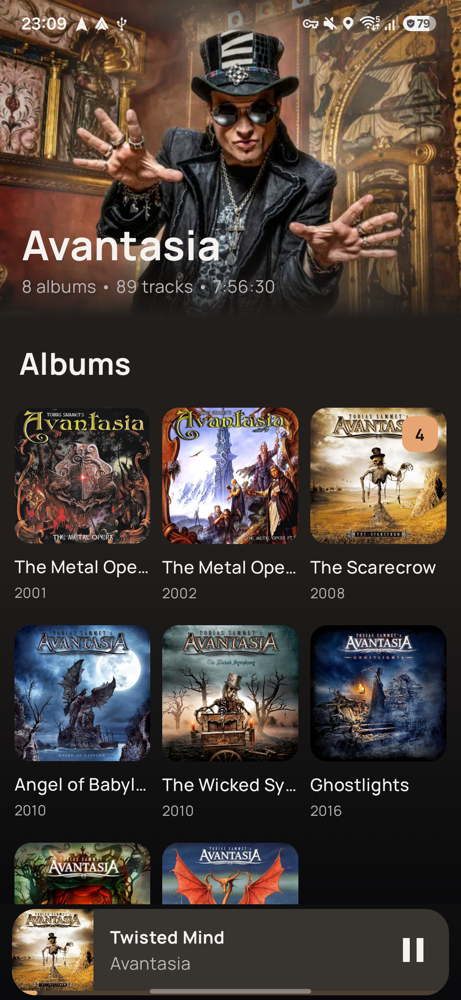
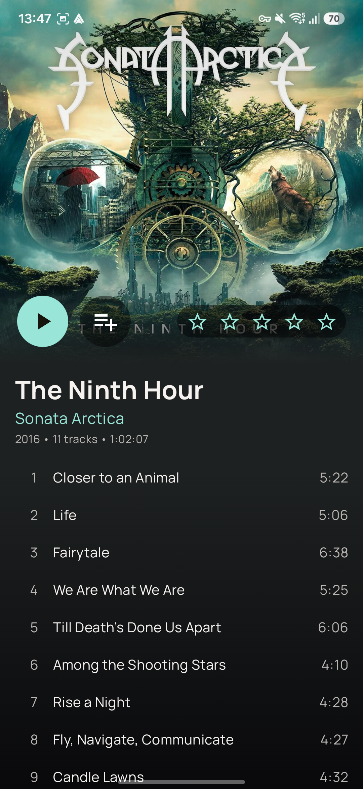
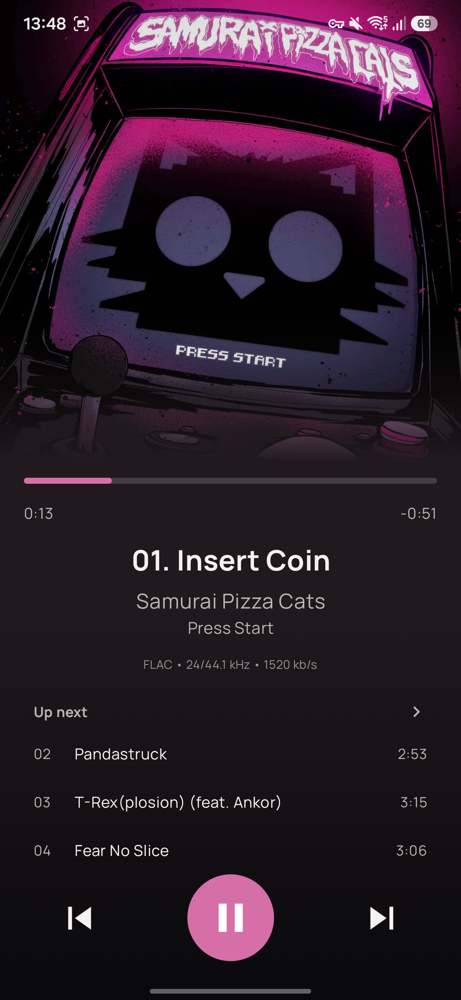

# Coda — Album-First Navidrome Client for Android

Coda is a focused, album-first Android client for Navidrome and compatible OpenSubsonic servers.
It is built for people who want their server to remain the source of truth, without waiting for a
mobile library database to synchronize.

Coda is an independent community project and is not affiliated with or endorsed by Navidrome.

> **Project status:** Coda is early alpha software. It already serves as a daily music player, but
> expect rough edges and changes while the first public versions are tested on more devices and
> servers.

<p align="center">
  
  
  
  
</p>

## Why Coda exists

Keeping a synchronized offline mirror of the server library is a useful design, but it can also mean
new albums and server-generated playlists remain stale until another synchronization finishes. Coda
is intended for listeners who prefer to query the server directly instead.

Coda deliberately takes the opposite approach:

- Navidrome is authoritative for artists, albums, playlists, ratings, search, and the saved queue.
- Opening a playlist fetches its current contents from the server.
- Pull-to-refresh requests fresh data without a background polling loop.
- Library metadata is not copied into a second local database.
- Phone artwork is cached persistently by the UI image loader so browsing still feels responsive;
  changed server artwork can be refreshed explicitly from Connection.

The result is a small client centered on albums rather than podcasts, radio, generated mixes,
recommendation feeds, or extensive configuration screens.

## Highlights

- Album-oriented home screen with recently added, top rated, recent releases, recently played,
  artists, playlists, and queue continuation.
- Chronological artist discographies and compact album track lists.
- Album, artist, and track search.
- Five-star album ratings written directly to the server.
- A real playback queue shared by the phone UI, media notification, and Android Auto.
- Server-authoritative playlists that retain their exact track order and are presented in album
  sections.
- Dynamic artwork-derived colors and a deliberately minimal interface.
- Android password-manager Autofill and encrypted credential storage using Android Keystore.
- Android Auto browsing, grouped search, playback controls, and phone-proxied artwork for private
  servers and VPNs such as Tailscale.

## Streaming and cache behavior

Coda is online-first, not an offline download manager.

- On Wi-Fi or Ethernet, Coda requests the original stream. This can be lossless FLAC, including
  high-resolution material, when that is what the server stores.
- On cellular, Coda requests Opus transcoding. No bitrate is hardcoded in the app; the server's
  transcoding configuration decides the delivered bitrate.
- Playback starts progressively rather than waiting for the complete track to download.
- A transient **audio cache** begins filling as soon as a queue exists: the current track first,
  followed by the next three. Entries outside that rolling window are discarded.
- Changing between Wi-Fi and cellular does not interrupt the current track. Upcoming uncached tracks
  are switched to the appropriate stream variant.

There is intentionally no permanent offline library. The bounded audio window survives Android
process/service recreation so prepared playback remains useful in poor reception, and is cleared
when the queue is emptied or the account disconnects.

Artwork uses separate caches: the phone UI shares consolidated 420/500/600/1200 px sources through
its image cache, while Android Auto uses a bounded car-artwork cache described below. These are not
part of the four-track audio window. The Connection screen can clear stale artwork explicitly.

## Queue handoff

Coda reads and writes Navidrome's saved play queue. Queue order, current track, and approximate
playback position can therefore be continued by another Navidrome client that supports the same
server-side queue.

Android publishes a snapshot when playback starts or changes track and every 15 seconds while music
continues. It does not overwrite the shared queue while paused. On Home, a queue written by another
client appears as an explicit Continue card; Coda's own queue is restored paused after a cold start.
Scrobbles are retried after transient failures, and a track is submitted as played only after a
genuine Media3 completion. Seeking near the end or manually skipping does not count as completion.

## Android Auto

The Android Auto interface exposes four intentionally short sections:

- Artists, grouped into `#` and `A`–`Z` buckets to respect car-host list limits.
- Recently added albums.
- Recently played albums.
- Playlists.

Search results are grouped into Artists, Albums, and Songs. Selecting an album or playlist creates
the complete playback queue, shared with the phone.

Android Auto's **For you** card receives up to ten recently played albums. Coda authorizes the
platform-trusted Google recommendation broker for this library request while keeping other trusted
system controllers limited to transport controls.

Android Auto requires local artwork URIs. Coda downloads private server artwork through the phone's
own connection, keeps a separate 128 MB **car-artwork cache**, and exposes it to the car through a
local content provider. This also works when Navidrome is reachable only through a phone VPN such as
Tailscale. Browse thumbnails request 320 px sources while playback artwork requests 600 px. Cache
misses use bounded background downloads and a local pipe, so slow server-side image resizing does
not block the car host or discard the original artwork request.

## Login and privacy

The first-run screen asks for a server URL, username, and password, verifies them with the server,
and supports Android's Autofill framework. This allows compatible password managers such as Google
Password Manager, Samsung Pass, Bitwarden, and 1Password to fill and save the login.

Credentials are encrypted with a non-exportable Android Keystore key. Coda has no analytics,
advertising, or tracking SDK. Server credentials are not compiled into the APK.

HTTPS is strongly recommended whenever the server is reachable over an untrusted network. Plain HTTP
remains available for explicitly trusted local-network installations, but Coda requires an explicit
warning confirmation before connecting without transport encryption.

## Requirements

- Android 9 or newer (API 28+).
- A Navidrome server or a compatible OpenSubsonic implementation.
- Network access to that server from the phone.

The app currently supports one server and one account at a time. Disconnect from the Connection page
to remove the stored credentials and use another account. Playback and artwork caches are isolated by
account and the disconnected account's transient data is cleared in the background.

## Building

Prerequisites:

- JDK 17.
- Android SDK 36 with the corresponding build tools.

Clone the repository and build a debug APK:

```sh
./scripts/gradle.sh assembleDebug
```

The APK is written to `app/build/outputs/apk/debug/app-debug.apk`.

Run the verification suite with:

```sh
./scripts/verify.sh
```

With a booted emulator, run the credential-free Compose UI smoke test with an explicit serial:

```sh
./scripts/ui-test.sh emulator-5554
```

The current implementation and verification boundaries are recorded in
[docs/development-baseline.md](docs/development-baseline.md).

Runtime server credentials are entered inside the app. `local.properties` is used only by standard
Android tooling when a local SDK path is required and must not contain Coda credentials.

Maintainer instructions for producing and verifying signed APKs are in
[docs/releasing.md](docs/releasing.md).

## Deliberately out of scope

- Podcasts and internet radio.
- Generated mixes and recommendation algorithms.
- Permanent offline downloads and offline-library management.
- Multiple simultaneous servers or user profiles.
- Landscape phone layouts; the phone UI is currently locked to portrait.

## Vibe-coded, openly

Coda was designed and implemented through an iterative, conversational workflow with OpenAI Codex.
The product direction, design decisions, hands-on listening tests, car testing, and final judgment
were human-led; a large portion of the implementation was AI-assisted. In other words: this project
was vibe-coded, deliberately and transparently.

That origin is not a substitute for review. Bug reports, code review, testing on different servers
and devices, and focused contributions are welcome.

## License

Copyright 2026 iamtoolino.

Licensed under the Apache License, Version 2.0. See [LICENSE](LICENSE).
The bundled Manrope font is licensed separately under the SIL Open Font License; its license text is
included with the app assets.
