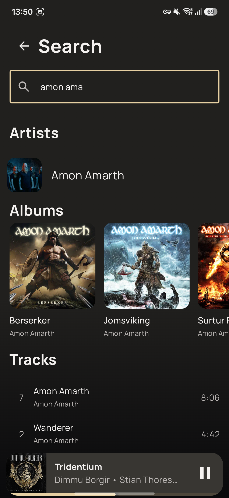

# Coda — Album-First Navidrome Client for Android

Coda is a focused native Android client for Navidrome and compatible OpenSubsonic servers. It keeps
artwork, albums, and the listening queue at the center of the experience.

Coda is an independent community project and is not affiliated with or endorsed by Navidrome.

<p align="center">
  
  
  
  
</p>

## Highlights

- Artwork-led native Android design with album-derived colors.
- Album-first browsing with chronological discographies, multidisc releases, ratings, and search.
- A visible queue with saved position and handoff between compatible clients, plus album continuation
  across Coda for Android and macOS.
- Original-format streaming on Wi-Fi, server-configured Opus on cellular, and scrobbling.
- Android Auto, notification and Bluetooth controls, and a dedicated immersive Now Playing view.

## Requirements

- Android 9 or newer.
- A Navidrome server or compatible OpenSubsonic implementation.
- Network access to that server; HTTPS is recommended outside a trusted network.

## Install

Download the APK from the [latest GitHub release](https://github.com/iamtoolino/coda-android/releases/latest)
and open it on your phone. Allow installation from your browser or file manager if prompted.

## Build from source

Install JDK 17 and Android SDK 36 with its build tools. Configure the SDK path through `ANDROID_HOME`
or `sdk.dir` in `local.properties`.

Then build the debug app:

```sh
./scripts/gradle.sh assembleDebug
```

The APK is written to `app/build/outputs/apk/debug/app-debug.apk`.

Run the automated checks with:

```sh
./scripts/verify.sh
```

## Privacy

Coda contains no analytics, advertising, or tracking SDK. Server credentials are encrypted
using Android Keystore.

Artwork and a small rolling audio window are cached on the device. Disconnecting clears the
account's credentials and caches.

## License

Copyright 2026 iamtoolino.

Coda's source code is licensed under the [Apache License, Version 2.0](LICENSE).
Bundled libraries retain their respective licenses.
